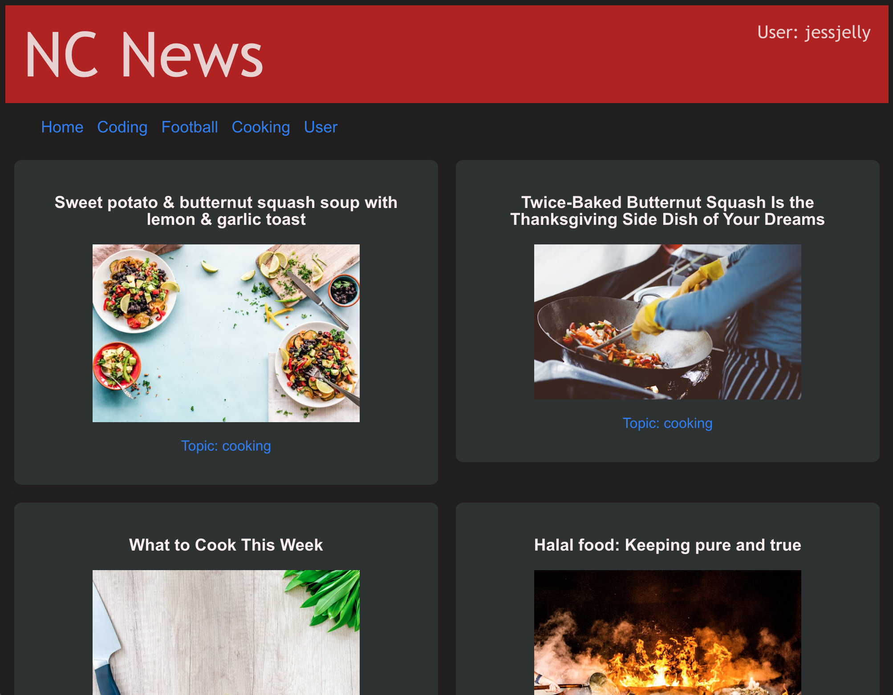

# News Articles Website

This repository contains the source code for a website that displays news articles. The project connects to a backend service using the Northcoders API to fetch and manage news content.

    
     

## Features

View News Articles: Browse through various news articles by clicking on article cards.
User: Select a user from the user page to log in.
Post Management: As a logged-in user, you can create and delete comments on articles.

Getting Started
To set up the project locally, follow these steps:

### 1: Clone the repository
Copy the link and paste it into a new directory in your command line.

### 2: Install dependencies
Ensure you have Node.js installed, then run:

npm install

### 3: Run the project
Start the development server by entering the following command:

npm run dev

This will start the server and provide a local development URL.

### 4:Access the application:
After running the development server, click on the provided link to open the website in your browser.

## Usage

Login: Go to the user page and select a user icon to log in.
Read Articles: Click on any article card to view its full content.
Manage Posts: Once logged in, you can like an article, create new comments, or delete existing ones on any article.

